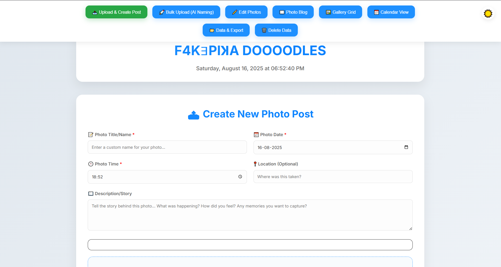
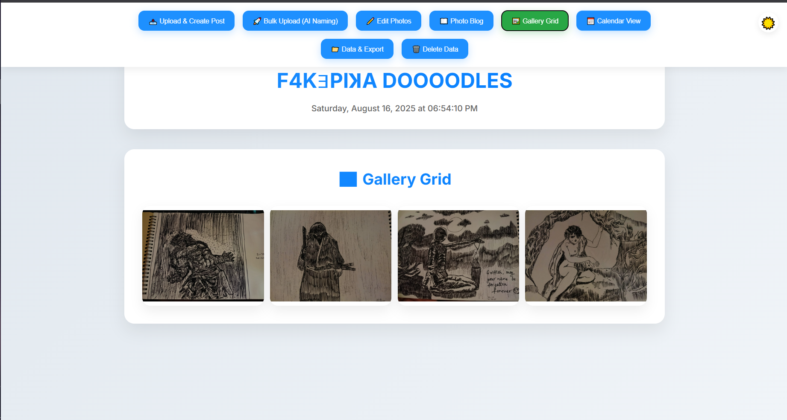
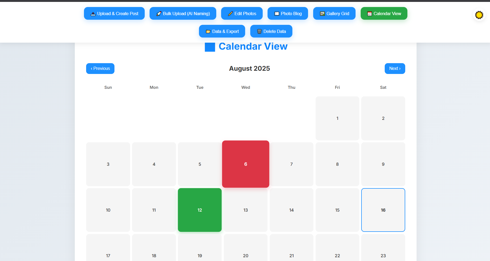
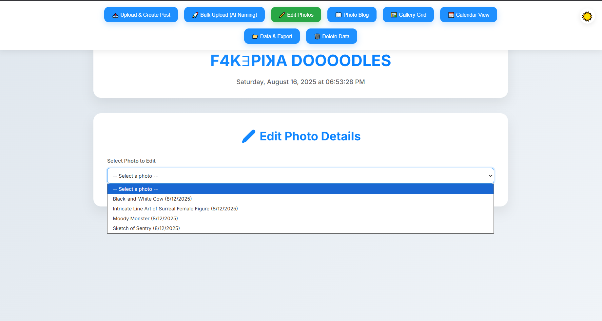
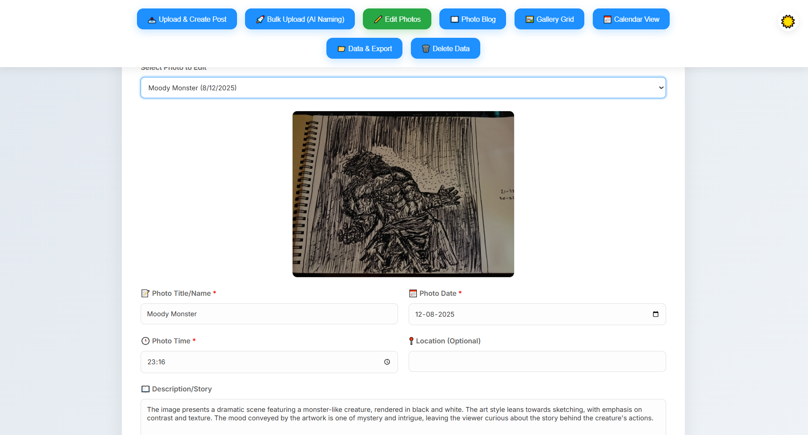
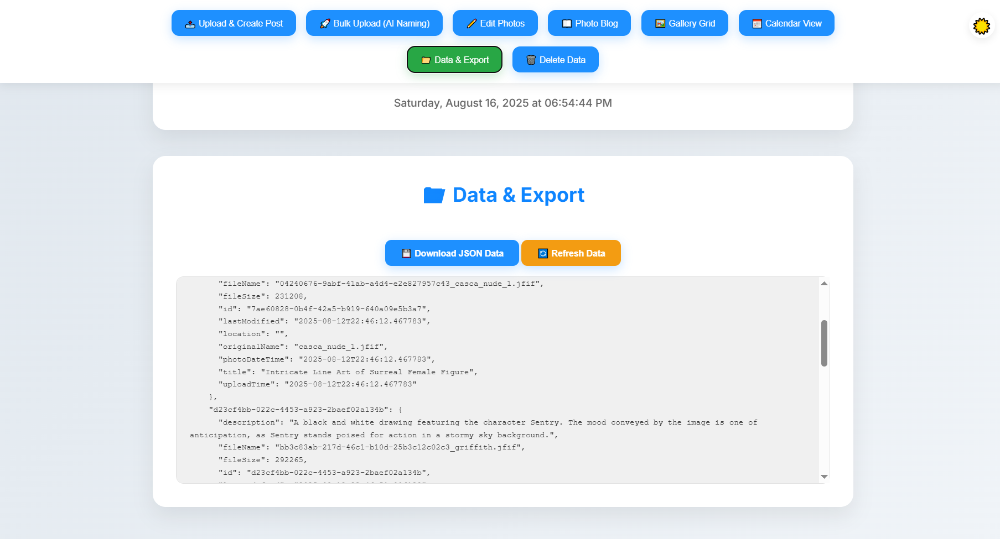

# 📸 F4K∃PIꓘA DOOOODLES 📝

A full-stack photo blog application built with a Python Flask backend and a modern, responsive frontend.

This project is a significantly enhanced prototype of a previous version, now offering a richer set of features for managing and displaying your photo collection.

## ✨ App Features & Highlights ✨

This iteration of the "F4K∃PIꓘA DOOOODLES" application introduces several key functionalities and improvements:

| Feature Area                      | Description                                                                                                                                                                                                                                                                                                                                                                                                                                                                                                                                                                                                                                                                           |
| --------------------------------- | ------------------------------------------------------------------------------------------------------------------------------------------------------------------------------------------------------------------------------------------------------------------------------------------------------------------------------------------------------------------------------------------------------------------------------------------------------------------------------------------------------------------------------------------------------------------------------------------------------------------------------------------------------------------------------------- |
| **Photo Upload**            | Easily upload new photos with a dedicated form for adding titles, dates, locations, and descriptions. It supports both drag-and-drop and multiple file selection, making the upload process intuitive. The backend ensures robust file handling by automatically generating unique filenames to prevent conflicts and storing photos securely in a dedicated photos directory.                                                                                                                                                                                                                                                                                                        |
| **AI Integration**          | **New!**The application now includes a powerful AI analysis feature for bulk uploads. Leveraging an Ollama server (specifically the llava model), images uploaded in bulk are automatically analyzed to generate professional titles and descriptions. This significantly streamlines the process of cataloging large photo collections, providing intelligent, context-aware metadata without manual input. The `ai_analyzer.py`script handles the communication with the Ollama server and processes the AI's output.                                                                                                                                                             |
| **Database Integration**    | **New!**Instead of a flat `photo_metadata.json`file, all photo details (title, date, time, location, description, file size, upload time, last modified, and original name) are now stored in a `database.db`SQLite database. This provides more robust data management, allowing for efficient querying, updating, and indexing of photo metadata. The `app.py`backend manages all database interactions, ensuring data persistence and integrity.                                                                                                                                                                                                                             |
| **Physical Image Rotation** | Photos can be rotated directly from the frontend, with the changes being applied physically to the image file on the server. The application also handles EXIF orientation data to ensure images are displayed correctly regardless of their original orientation. This is crucial for maintaining image integrity and reducing the need for external editing tools.                                                                                                                                                                                                                                                                                                                  |
| **Multiple Views**          | The application offers diverse ways to view your photos:`<ul><li>` **Photo Blog**: Displays photos in a chronological blog format, complete with detailed descriptions and subtle date headings to organize entries.`</li><li>` **Gallery Grid**: A modern, responsive grid layout for browsing photos, offering a visually appealing overview. Clicking on a photo in this view opens a full-screen modal viewer for a closer look.`</li><li>` **Calendar View**: A calendar highlights days with photo uploads, allowing users to effortlessly filter the gallery and blog by date, making it easy to revisit memories from specific periods.`</li></ul>` |
| **Data Management**         | Users have comprehensive control over their photo data. They can view all photo metadata in a formatted JSON view for easy inspection and debugging, and download it for backup purposes. A dedicated section for permanent deletion of individual photos and all data is also included, ensuring data privacy and control.                                                                                                                                                                                                                                                                                                                                                           |
| **User-Friendly UI**        | The frontend is a single-page application with a clean, intuitive design and smooth transitions, providing a seamless user experience. It features a dark mode toggle for personalized viewing preferences. The interface is built with the Inter font for a professional and legible appearance across all devices, ensuring accessibility and visual appeal on both desktop and mobile. The navigation bar is fixed at the top, allowing for easy access to different sections.                                                                                                                                                                                                     |

## 🤖 AI Capabilities: ai_analyzer.py Explained 🧠

The `ai_analyzer.py` script is a core component that powers the AI Naming feature for bulk photo uploads.

| Component               | Description                                                                                                                                                                                                                                                                                                                        |
| ----------------------- | ---------------------------------------------------------------------------------------------------------------------------------------------------------------------------------------------------------------------------------------------------------------------------------------------------------------------------------- |
| **Purpose**       | This Python script acts as an intermediary, facilitating communication between the Flask backend and a local Ollama server. Its primary function is to analyze images using an AI model and generate relevant metadata.                                                                                                            |
| **AI Model Used** | It specifically interacts with the `llava`model running on your local Ollama server. The llava model is a powerful multimodal AI capable of understanding and describing images.                                                                                                                                                 |
| **Functionality** | When you perform a bulk upload,`ai_analyzer.py`takes each image, encodes it, sends it to the llava model, and then extracts a professional title and a concise description (20-30 words) for the image from the AI's response. These AI-generated details are then used to populate the photo's metadata in the `database.db`. |
| **Benefits**      | This automation significantly reduces manual effort for cataloging large batches of photos, ensuring consistent and informative titling and descriptions.                                                                                                                                                                          |
| **Prerequisites** | Requires a local Ollama server running and the llava model downloaded (`ollama run llava`).                                                                                                                                                                                                                                      |

## 🖼️ Application Screenshots 🖥️

Here is a visual overview of the application's key features. These screenshots showcase the various interfaces and functionalities of the F4K∃PIꓘA DOOOODLES application.

### 📋 Main Menu & Navigation


*The application's main navigation interface*

### 📤 Upload & Create Post


*Bulk upload interface with AI-powered photo analysis*

### 🖼️ Gallery Views


*Responsive gallery grid layout for browsing photos*

### 📅 Calendar View


*Monthly calendar highlighting days with uploaded photos*

### ✏️ Photo Management


*Photo editing interface - Main view*


*Photo editing interface - Advanced options*

### 📊 Data Management


*Data export and JSON metadata viewer*


*Data management and deletion interface*

## 🚀 Getting Started: Running the App

### 📋 Prerequisites

* Python 3.6 or higher
* pip (Python package installer)
* **Ollama Server** : For AI naming in bulk uploads, you need a local Ollama server running with the llava model downloaded. You can download and run llava using `ollama run llava`.

### ⚙️ Installation

1. **Clone the repository:**
   ```bash
   git clone https://github.com/Avdh512/DrawingPika.gitcd DrawingPika
   ```
2. **Create a virtual environment (recommended) or you can just use the existing one that I made:**
   ```bash
   python -m venv venv
   ```
3. **Activate the virtual environment:**
   * **On Windows:**
     ```bash
     venv\Scripts\activate
     ```
   * **On macOS/Linux:**
     ```bash
     source venv/bin/activate
     ```
4. **Install the dependencies:**
   ```bash
   pip install -r requirements.txt
   ```

### ▶️ Running the Application

1. **Start the Ollama server and download the llava model (if you haven't already):**

   ```bash
   ollama run llava
   ```

   Keep this terminal window open.
2. **Start the Flask server:**

   ```bash
   python app.py
   ```

   *Note: The previous `server.py` has been replaced by `app.py`.*
3. **Access the application:**
   Open your web browser and navigate to `http://127.0.0.1:5000`.
   The server will automatically create the necessary `photos` directory and `database.db` file if they don't already exist.

## 📁 Project File Structure

The project structure is organized for clarity and maintainability, separating backend logic, frontend assets, and data storage.

| Directory/File                        | Description                                                                                                                                                                                                                                                                                                                     |
| ------------------------------------- | ------------------------------------------------------------------------------------------------------------------------------------------------------------------------------------------------------------------------------------------------------------------------------------------------------------------------------- |
| `photos/`                           | This directory serves as the dedicated storage location for all uploaded image files. Each image is saved with a unique filename to prevent conflicts.                                                                                                                                                                          |
| `backend/`                          | **New!**This directory encapsulates all the Python Flask backend logic. It contains the main application file and modules for AI analysis and database interaction.                                                                                                                                                             |
| `backend/ai_analyzer.py`            | **New!**This Python script is crucial for enabling the AI naming feature during bulk uploads. It handles the communication with your local Ollama server, encodes the image data, sends it to the llava model for analysis, and then parses the AI-generated title and description, returning them for storage in the database. |
| `backend/app.py`                    | **Updated!**This is the main Flask application file. It defines all the backend routes, handles file uploads (both single and bulk), manages interactions with the SQLite `database.db`, and serves the static frontend files. It's the central hub for all server-side operations.                                           |
| `backend/database.db`               | **New!**This is the SQLite database file where all photo metadata (titles, dates, descriptions, file sizes, upload timestamps, and original filenames) is persistently stored. This provides a structured and efficient way to manage your photo collection's data, replacing the previous JSON file.                           |
| `frontend/public/`                  | This directory contains all the static frontend files that are served to the user's browser.                                                                                                                                                                                                                                    |
| `frontend/public/index.html`        | **Updated!**The main HTML file that defines the structure and layout of the single-page application, including all sections like upload, galleries, calendar, and data management. It acts as the entry point for the user interface.                                                                                           |
| `frontend/public/static/`           | This subdirectory holds static assets like CSS stylesheets and JavaScript files.                                                                                                                                                                                                                                                |
| `frontend/public/static/script.js`  | **Updated!**This JavaScript file contains all the client-side logic, handling user interactions (like drag-and-drop, form submissions, and button clicks), making API calls to the Flask backend, dynamically rendering the photo galleries and calendar view, and performing client-side form validation.                      |
| `frontend/public/static/styles.css` | **Updated!**This CSS file defines the visual styles of the application, including responsive design for various screen sizes, light and dark mode theming, and animations to provide a modern and engaging user interface.                                                                                                      |
| `screenshots/`                      | This directory stores visual captures of the application's various features and interfaces, used in this README for demonstration.                                                                                                                                                                                              |
| `venv/`                             | This is the Python virtual environment, which isolates project dependencies to avoid conflicts with other Python projects on your system.                                                                                                                                                                                       |
| `requirements.txt`                  | This file lists all the Python dependencies required for the backend, allowing for easy installation via pip.                                                                                                                                                                                                                   |
| `.gitignore`                        | This file specifies intentionally untracked files that Git should ignore, such as the virtual environment and database file.                                                                                                                                                                                                    |

## 🛠️ Usage & API Endpoints

### 🌐 Frontend

The `index.html` file is a self-contained single-page application. All client-side logic, including form handling, gallery rendering, and interactions, is managed by `script.js` and styled by `styles.css`.

### 🖥️ Backend API

The Flask backend exposes a set of RESTful API endpoints for managing photo data.

| Endpoint                       | Method | Description                                                                                                                                                                                                                        |
| ------------------------------ | ------ | ---------------------------------------------------------------------------------------------------------------------------------------------------------------------------------------------------------------------------------- |
| `/`                          | GET    | Serves the main `index.html`file, which loads the frontend application.                                                                                                                                                          |
| `/api/upload_single`         | POST   | **New!**Handles the upload of a single photo along with user-provided metadata (title, date, time, location, description). Saves the photo to the photos directory and its metadata to the `database.db`.                        |
| `/api/bulk_upload`           | POST   | **New!**Facilitates the bulk upload of multiple photos. For each uploaded image, it leverages the AI analysis (via `ai_analyzer.py`) to automatically generate a title and description before saving the photo and its metadata. |
| `/api/photos`                | GET    | Retrieves all photo metadata from the `database.db`, organized by date. This endpoint is used to populate the blog and grid galleries, as well as the calendar view.                                                             |
| `/api/update_metadata`       | POST   | Updates metadata for a specific photo identified by its ID. This includes updating text fields and physically rotating the image file on the server.                                                                               |
| `/api/delete_photo`          | POST   | **New!**Deletes a single photo identified by its ID from both the filesystem (photos directory) and its corresponding record in the `database.db`. This provides granular control over individual photo deletion.                |
| `/api/delete_all_photos`     | POST   | **New!**Permanently deletes all photos from the photos directory and clears all metadata from the `database.db`. This action is irreversible.                                                                                    |
| `/photos/<path:filename>`    | GET    | Serves a specific photo file from the photos directory. This endpoint handles requests for image display across the application's various views.                                                                                   |
| `/api/metadata`              | GET    | Retrieves all raw photo metadata as a flat dictionary. This is primarily used for the JSON viewer and data export functionality.                                                                                                   |
| `/api/photos/by-date/<date>` | GET    | **New!**Retrieves photos specifically for a given date. This is used by the calendar view to filter and display photos from a selected day.                                                                                        |
| `/api/stats`                 | GET    | Provides statistical information about the photo collection, such as total photos, unique upload dates, and photos per date.                                                                                                       |

## 🤝 Contribution Guidelines

Contributions are welcome! If you find a bug or have a suggestion, please open an issue or submit a pull request.

## 📄 License Information

This project is open-source and available under the MIT License.
