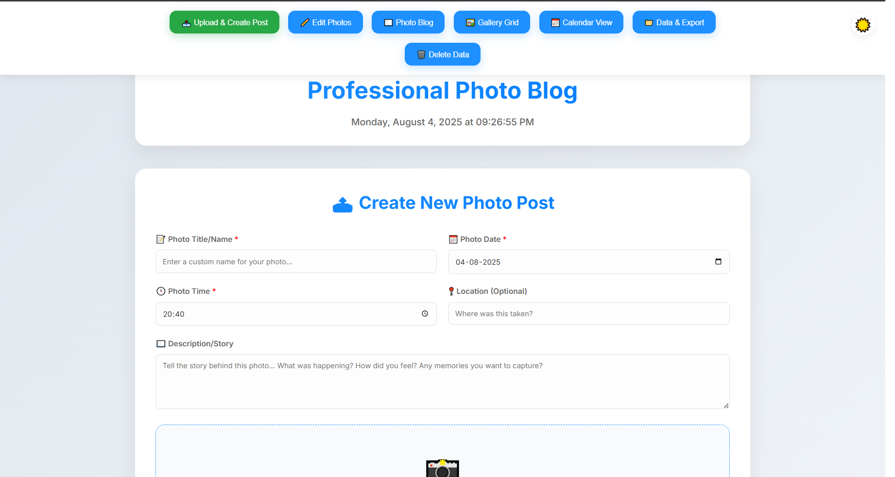
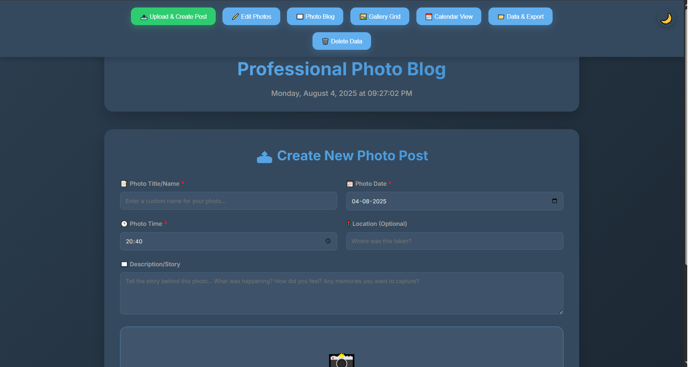
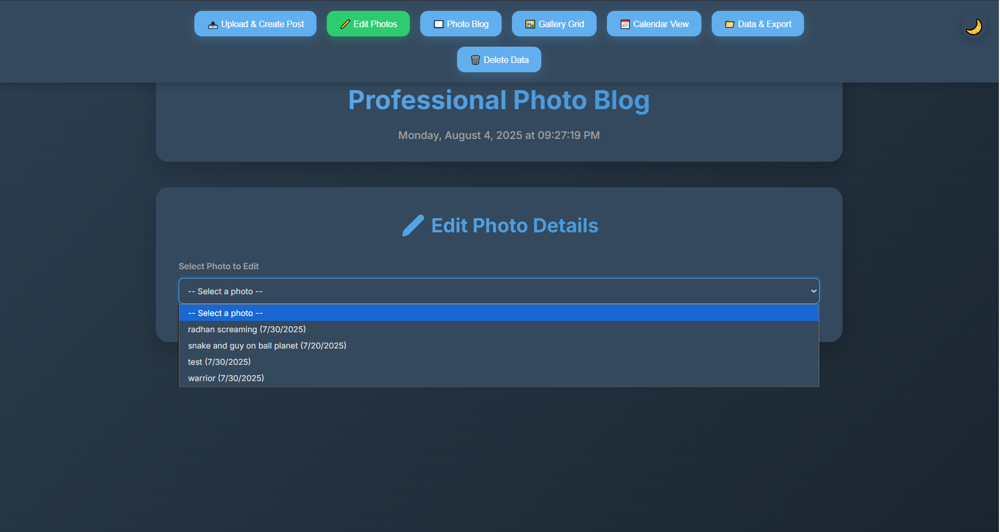
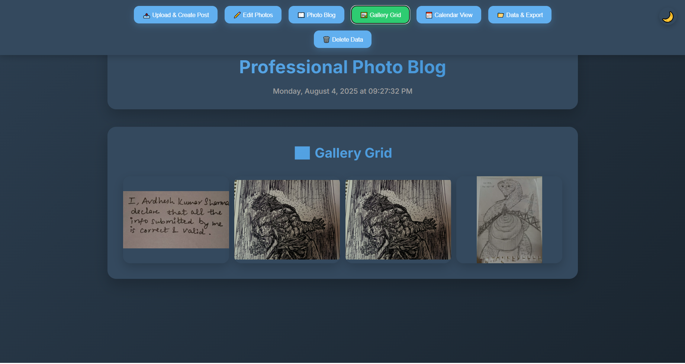
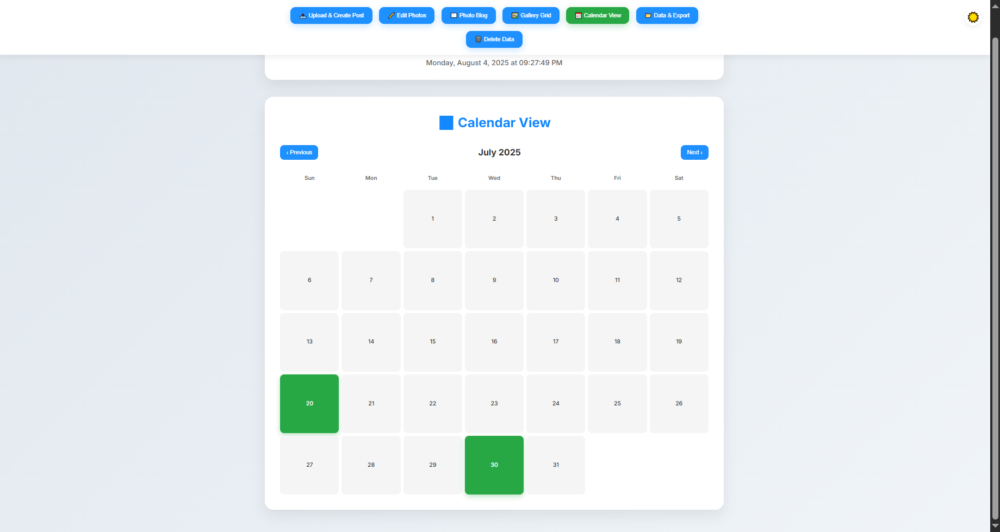
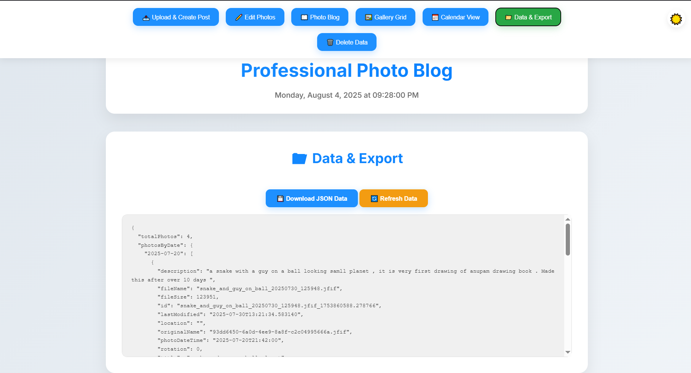

# 📸 Professional Photo Blog 📝

**A full-stack photo blog application built with a Python Flask backend and a modern, responsive frontend.**


## ✨ App Features & Highlights ✨

* **Photo Upload:** Easily upload new photos with a dedicated form for adding titles, dates, locations, and descriptions. Supports drag-and-drop and multiple file selection.
* **Image Management:** The server automatically generates unique filenames to prevent conflicts and stores photos in a dedicated `photos` directory.
* **RESTful API:** A Flask-based backend provides endpoints for uploading, retrieving, updating, and deleting photos and their metadata.
* **Dynamic Metadata:** Photo details like title, date, time, location, and description are stored in a `photo_metadata.json` file for persistence.
* **Physical Image Rotation:** Photos can be rotated directly from the frontend, with the changes being applied physically to the image file on the server. The application also handles EXIF orientation data.
* **Multiple Views:**
  * **Photo Blog:** Displays photos in a chronological blog format, complete with detailed descriptions.
  * **Gallery Grid:** A modern, responsive grid layout for browsing photos, with a full-screen modal viewer on click.
  * **Calendar View:** A calendar highlights days with photo uploads, allowing users to filter the gallery by date.
* **Data Management:** Users can view all photo metadata in a formatted JSON view and download it for backup purposes. A dedicated section for permanent deletion of photos and data is also included.
* **User-Friendly UI:** The frontend is a single-page application with a clean design, smooth transitions, and a dark mode toggle. The interface is built with the **Inter** font for a professional and legible appearance across all devices.

## 🖼️ Application Screenshots 🖥️

**Here is a visual overview of the application's key features. These screenshots are located in the **`screenshots` folder within your project repository, with the specified file paths.

### Upload & Create Post (Light Mode)

The main upload form, where users can add new photos and their metadata.


### Upload & Create Post (Dark Mode)

The same upload form in dark mode.


### Edit Photo Details

Selecting an existing photo from the dropdown to edit its metadata.


### Gallery Grid

Browsing photos in a responsive gallery grid layout.


### Calendar View

A monthly calendar highlighting days with uploaded photos.


### Data & Export

Viewing and exporting all photo metadata in a JSON format.


## 🚀 Getting Started: Running the App

### 📋 Prerequisites

* **Python 3.6 or higher**
* `pip` (Python package installer)

### ⚙️ Installation

1. **Clone the repository:**

   ```
   git clone https://github.com/Avdh512/DrawingPika.git
   cd DrawingPika

   ```
2. **Create a virtual environment** (recommended) or you can just use the exisiting one that i made:

   ```
   python -m venv venv

   ```

   * **On Windows:**
     ```
     venv\Scripts\activate

     ```
   * **On macOS/Linux:**
     ```
     source venv/bin/activate

     ```
3. **Install the dependencies:**

   ```
   pip install -r requirements.txt

   ```

### ▶️ Running the Application

1. **Start the Flask server:**
   ```
   python server.py

   ```
2. **Access the application:**
   Open your web browser and navigate to `http://127.0.0.1:5000`.

**The server will automatically create the necessary **`photos` and `public` directories, as well as an empty `photo_metadata.json` file if they don't already exist.

## 📁 Project File Structure

```
DrawingPika/
├── photos/                  # Directory where uploaded images are stored
├── public/                  # Directory for static frontend files
│   └── index.html
├── screenshots/             # Directory for application screenshots
├── venv/                    # Python virtual environment
├── .gitignore               # Ignored files for Git (e.g., virtual environment)
├── photo_metadata.json      # JSON file for storing all photo metadata
├── requirements.txt         # Python dependencies
└── server.py                # Flask backend application

```

## 🛠️ Usage & API Endpoints

### 🌐 Frontend

**The **`index.html` file is a self-contained single-page application. All client-side logic is handled by the embedded JavaScript.

### 🖥️ Backend API

| **Endpoint**                                        | **Method**                       | **Description**                                                                              |
| --------------------------------------------------------- | -------------------------------------- | -------------------------------------------------------------------------------------------------- |
| `/`                       | `GET`  | **Serves the main** `index.html`file.                        |
| `/api/photos`             | `GET`  | **Retrieves all photo metadata, organized by date.**                                         |
| `/upload`                 | `POST` | **Uploads a new photo and saves its metadata.**                                              |
| `/api/update_metadata`    | `POST` | **Updates metadata for a specific photo, including physical rotation.**                      |
| `/delete`                 | `POST` | **Deletes a photo and its metadata.**                                                        |
| `/photos/<path:filename>` | `GET`  | **Serves a specific photo file from the** `photos`directory. |
| `/api/metadata`           | `GET`  | **Retrieves all raw photo metadata.**                                                        |
| `/api/stats`              | `GET`  | **Provides statistics about the photo collection.**                                          |

## 🤝 Contribution Guidelines

**Contributions are welcome! If you find a bug or have a suggestion, please open an issue or submit a pull request.**

## 📄 License Information

**This project is open-source and available under the MIT License.**
